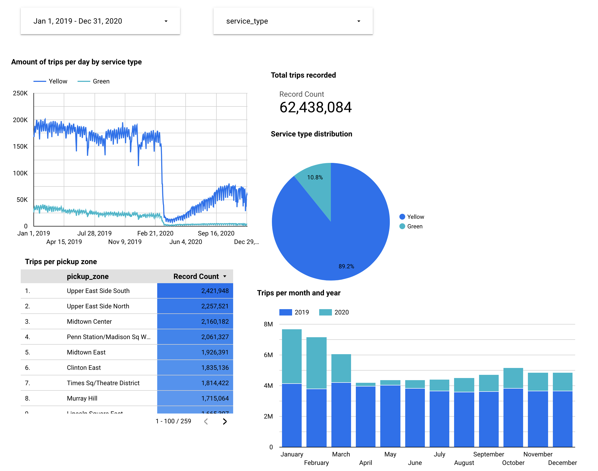

# Analytics Engineering

- Google BigQuery was connected to dbt and the taxi trips data.
- Using the star schema, a fact table was created with corresponding dimension tables.
- Fact table is then used to build an analytic dashboard detailing the trip analysis

## Dashboard View

