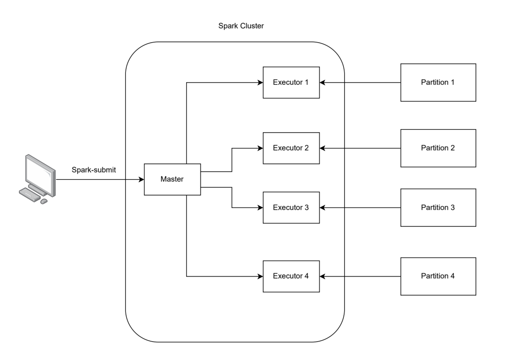
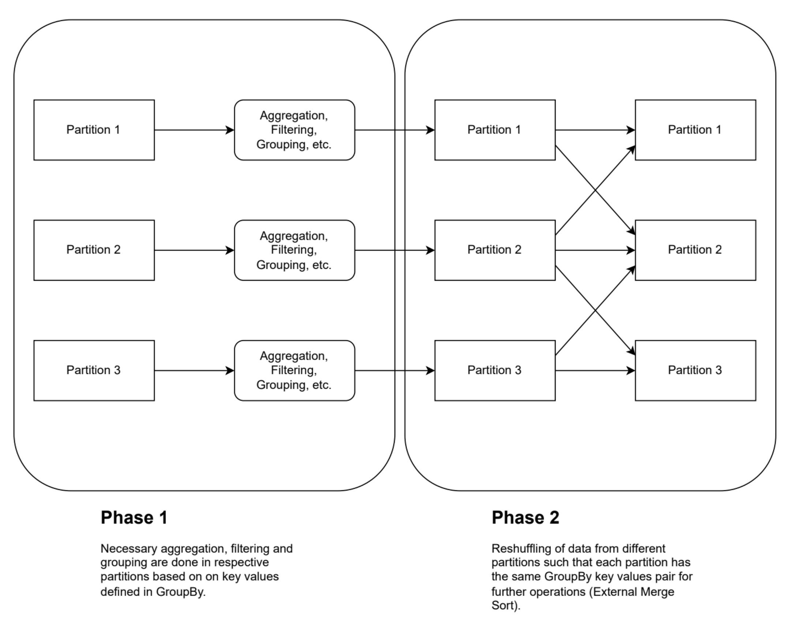

# Batch Processing

## Spark Cluster Architecture
- The diagram is a simple illustration of the components of a Spark architecture consisting of a master node, several worker nodes.
- Additionally, it shows how a spark job is sent using spark-submit and how partitioned data are fed to worker nodes.

## Group By in Spark
- Group By statement in Spark are usually executed in 2 phases: Initial transformation in each partition before data shuffling based on keys

## Joins in Spark
- Likewise, a Join statement in Spark first create a key value pair for the records in the respective tables before performing a data shuffle to join the data based on their key.

[!Joins](./images/joins.png)
